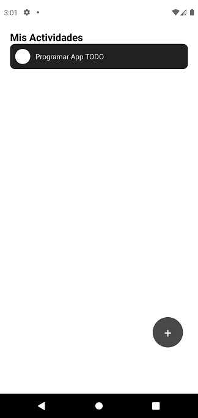
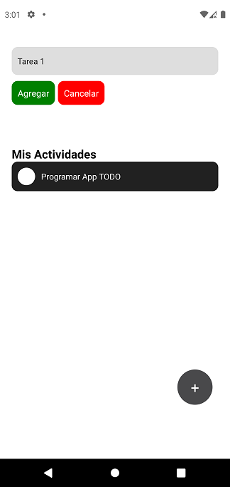
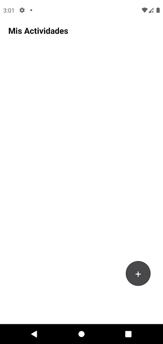

# Desarrollo de la Actividad 2 

Nombre: Guillermo Echagüe


## Instalar Expo en Local

Primero instalamos con npm explo-cli y exp (debemos de tener Node.js y npm instalados)
```bash
npm install -g expo-cli exp
```


## Inicio de proyecto
```bash
expo init todo-rn
```

To run your project, navigate to the directory and run one of the following yarn commands.

```bash
- cd todo-rn
- yarn start # you can open iOS, Android, or web from here, or run them directly with the commands below.
- yarn android
- yarn ios # requires an iOS device or macOS for access to an iOS simulator
- yarn web
```

### Funciones de App


### Inicio de App


### Apretar + de App


### Tarea asigmada de App


### Tarea eliminada de App


### Video desde el simulador


